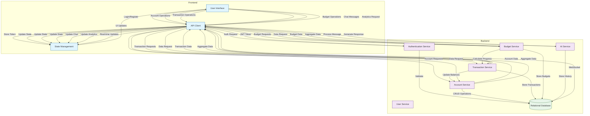

```mermaid
graph TD
    subgraph Frontend
        UI[User Interface]
        State[State Management]
        API[API Client]
    end

    subgraph Backend
        Auth[Authentication Service]
        User[User Service]
        Account[Account Service]
        Transaction[Transaction Service]
        Budget[Budget Service]
        AI[AI Service]
        DB[(Relational Database)]
    end

    %% User Authentication Flow
    UI -->|Login/Register| API
    API -->|Auth Request| Auth
    Auth -->|Validate| DB
    Auth -->|JWT Token| API
    API -->|Store Token| State

    %% Account Management Flow
    UI -->|Account Operations| API
    API -->|Account Requests| Account
    Account -->|CRUD Operations| DB
    Account -->|Account Data| API
    API -->|Update State| State

    %% Transaction Management Flow
    UI -->|Transaction Operations| API
    API -->|Transaction Requests| Transaction
    Transaction -->|Store Transactions| DB
    Transaction -->|Update Balances| Account
    Transaction -->|Transaction Data| API
    API -->|Update State| State

    %% Budget Management Flow
    UI -->|Budget Operations| API
    API -->|Budget Requests| Budget
    Budget -->|Store Budgets| DB
    Budget -->|Calculate Progress| Transaction
    Budget -->|Budget Data| API
    API -->|Update State| State

    %% AI Chat Flow
    UI -->|Chat Messages| API
    API -->|Process Message| AI
    AI -->|Store History| DB
    AI -->|Generate Response| API
    API -->|Update Chat| State

    %% Analytics Flow
    UI -->|Analytics Request| API
    API -->|Data Request| Transaction
    API -->|Data Request| Budget
    API -->|Data Request| Account
    Transaction -->|Aggregate Data| API
    Budget -->|Aggregate Data| API
    Account -->|Aggregate Data| API
    API -->|Update Analytics| State

    %% Real-time Updates
    DB -->|WebSocket| API
    API -->|Real-time Updates| State
    State -->|UI Updates| UI

    classDef frontend fill:#e1f5fe,stroke:#01579b
    classDef backend fill:#f3e5f5,stroke:#4a148c
    classDef database fill:#e8f5e9,stroke:#1b5e20

    class UI,State,API frontend
    class Auth,User,Account,Transaction,Budget,AI backend
    class DB database
``` 